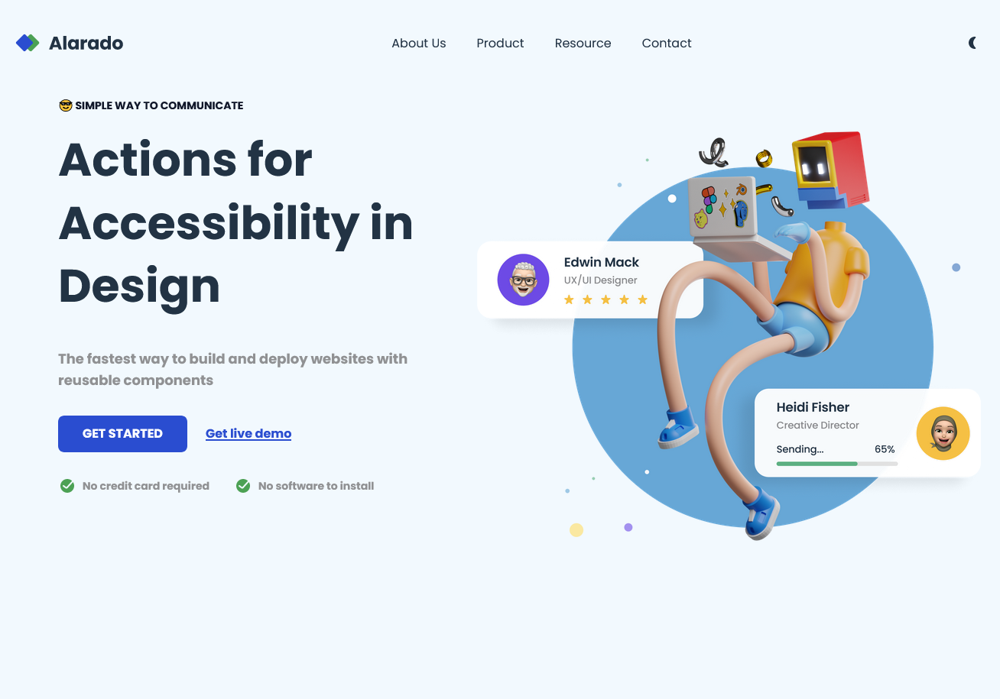

<h1 align="center">{Alarado Home Page}</h1>

<div align="center">
   Solution for a challenge from  <a href="https://devchallenges.io/editor/solution/1520" target="_blank">Devchallenges.io</a>.
</div>

<div align="center">
  <h3>
    <a href="https://github.com/Sotun-1010/Alarodo-Homepage">
      Solution
    </a>
    <span> | </span>
    <a href="https://devchallenges.io/editor/solution/1520">
      Challenge
    </a>
  </h3>
</div>

<!-- TABLE OF CONTENTS -->

## Table of Contents

- [Overview](#overview)
  - [Built With](#built-with)
- [How to use](#how-to-use)
- [Contact](#contact)
- [Acknowledgements](#acknowledgements)

<!-- OVERVIEW -->

## Overview



Introduce your projects by taking a screenshot or a gif. Try to tell visitors a story about your project by answering:

- What was your experience? It is my first tailwind project. I have been able to master tailwind to an extent through this project, and i can say i quite good at this, although there's always room for improvement. The original project requires pure css but i decided to use tailwind and i customized some part of the design to my own taste.
- What have you learned/improved? My knowledge of Tailwind
- Your wisdom? :) Keep pushing as always

### Built With

<!-- This section should list any major frameworks that you built your project using. Here are a few examples.-->

- [Tailwind] (<https://tailwindcss.com/>)
- [HTML] (<https://developer.mozilla.org/en-US/docs/Web/HTML/>)
- [CSS] (<https://developer.mozilla.org/en-US/docs/Web/CSS/>)

## How To Use

<!-- Example:  -->

To clone and run this application, you'll need [Git](https://git-scm.com) and [Node.js](https://nodejs.org/en/download/) (which comes with [npm](http://npmjs.com)) installed on your computer. From your command line:

```bash
# Clone this repository
$ git clone 

# Install dependencies
$ npm install

# Run the app
$ npm start
```

## Acknowledgements

<!-- This section should list any articles or add-ons/plugins that helps you to complete the project. This is optional but it will help you in the future. For example -->

- [Steps to replicate a design with only HTML and CSS](https://devchallenges-blogs.web.app/how-to-replicate-design/)
- [Node.js](https://nodejs.org/)
- [Marked - a markdown parser](https://github.com/chjj/marked)

## Contact

- GitHub [@Sotun-1010](https://github.com/Sotun-1010)
- Twitter [@O_G_Sotun](https://twitter.com/O_G_Sotun?t=kRiO1YNhYKn8NJJnxTZ42A&s=03)